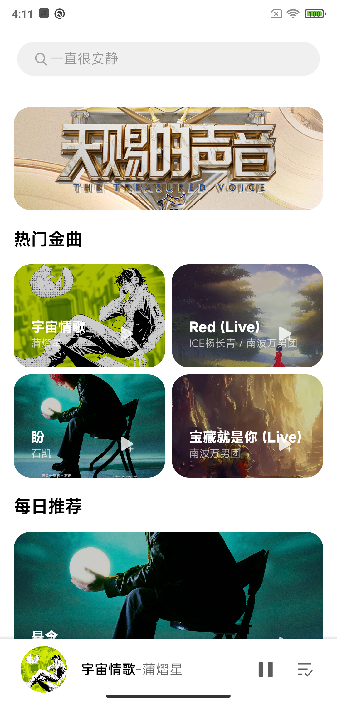
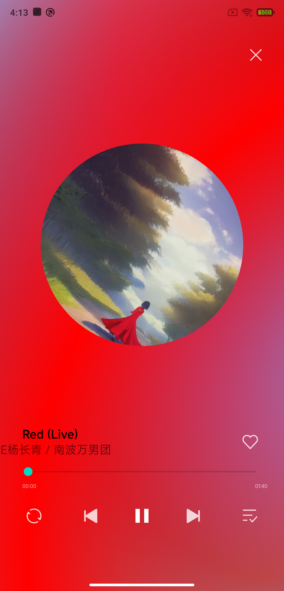
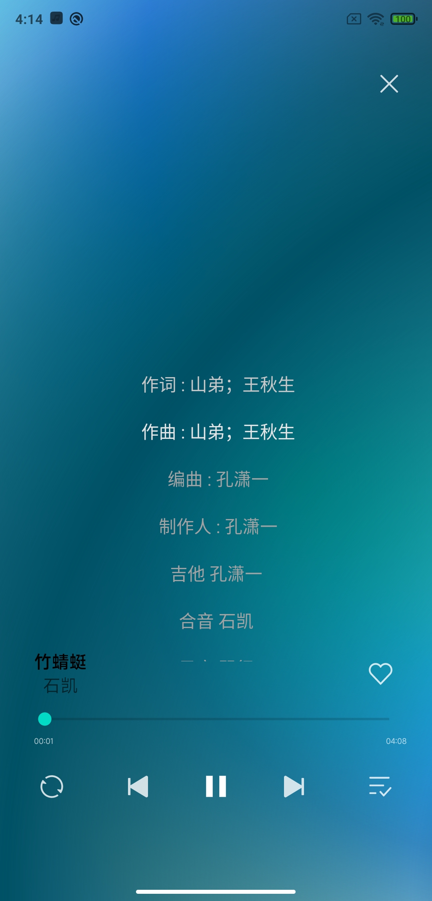
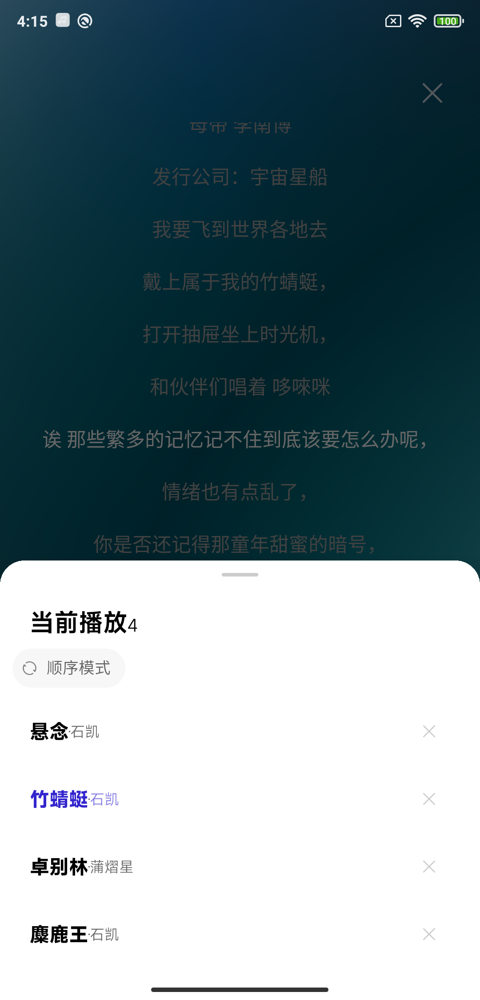
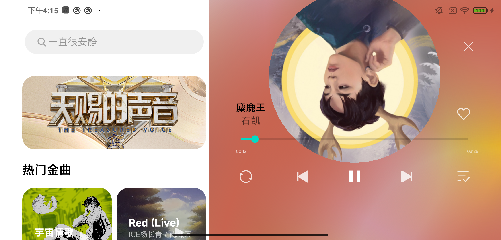

    

        <strong>nj-trainingcollege/miclassroom240819/androidgroup4/tanzhehao</strong>
         
      
    
<strong>实践课程</strong>

     

都实现了，对于布局还原度，个人感觉很完美。

比较尴尬的是前几天的Release是有问题的，ProGuard把我的Bean类给混淆了，导致Retrofit解析不了数据。

    <a href="app/release/app-release.apk?inline=false">Download Release App（Final）</a>

## 技术栈

太多了，比较喜欢炫技。

## 软件展示

软件部分界面效果如下：

    
    
    

    
    

